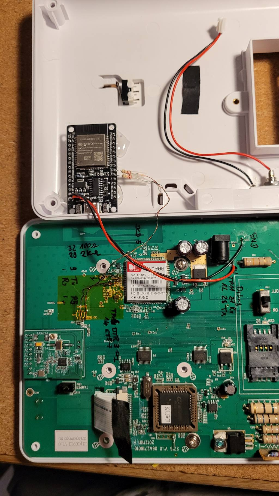
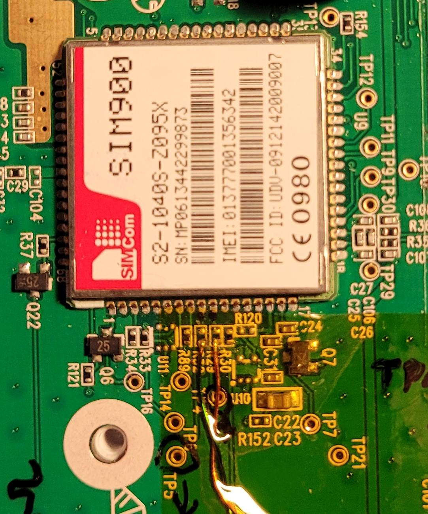

# Sim900 Emulator

This ESP32 firmware emulates a SIM900 GSM modem for legacy Blaupunkt alarm systems (e.g. SA2700, SA2500) and exposes alarm events via MQTT for Home Assistant integration.

Many of these alarm systems depend on a SIM900 modem using 2G, which is no longer supported by modern SIM cards and cellular networks in many regions. As a result, the original functionality is unusable, despite the alarm system hardware (door and motion sensors, alarm logic) remaining fully functional.

This project replaces the cellular modem with a local ESP32-based emulator, preserving the alarm system and integrating it into home automation setups.

## Overview

Sim900Emulator is an ESP32-based SIM900 modem emulator that:

- Communicates with the alarm system over a hardware UART
- Responds with SIM900-compatible AT command behavior
- Publishes alarm states, events, and messages to MQTT
- Uses Home Assistant MQTT Discovery for zero-config integration

## Features

- Target platform: ESP32
- Uses UART1 for the alarm-system interface
- SIM900-compatible modem emulation (AT commands)
- MQTT publishing of alarm state and events
- Home Assistant MQTT Discovery support
- Debug output via USB serial

- WiFi configuration and OTA firmware update via WifiManager
  (See https://github.com/tzapu/WiFiManager - WifiManager GitHub project for WiFi configuration)


## Configure Wi‑Fi and MQTT

Press the configuration button at startup to enter configuration mode. The firmware attempts to connect using stored WiFi credentials. If connection fails, it starts in AP mode at `192.168.4.1`. Access this address in a web browser to configure WiFi SSID, password, and MQTT broker settings.

## Modem UART pins and baud rate (ESP32)

The emulator uses a hardware UART to simulate the alarm system modem. Defaults are defined in `include/Sim900.h`:

```cpp
static constexpr int MODEM_TX = 16;        // ESP32 pin used as TX (connect to alarm RX)
static constexpr int MODEM_RX = 17;        // ESP32 pin used as RX (connect to alarm TX)
static constexpr unsigned long MODEM_BAUD = 9600;
```

## Wiring

- Disconnect the Sim900 RX/TX lines from the alarm system microcontroller (remove R29 and R32)
- Connect the alarm system microcontroller TX (R29 bottom pad) to the ESP32 `MODEM_RX` pin via 2k2 resistor
- Connect the alarm system microcontroller RX (R32 botom pad) to the ESP32 `MODEM_TX` pin via 2k2 resistor

<p align="left">
  
  
</p>

## Configuration Button

A push button should be connected to an I/O pin to enter the Wifi configuration mode. The used pin is defined in `include/Sim900Emulator.h`:

```cpp
// button to enter WiFi config mode
constexpr uint8_t BUTTON_PIN = 0;
```

Wiring:

- Connect an push button from the defined LED pin to GND.

## Status LED

A status LED can be connected to an I/O pin to indicate the Wifi and MQTT connection state. The used pin is defined in `include/Sim900Emulator.h`:

```cpp
 // built-in LED pin
constexpr uint8_t LED_PIN = 2;
```

Wiring:

- Connect an LED with resistor in series from the defined LED pin to GND.

LED behavior:

- off: initializing / no WiFi
- slow flash: WiFi connecting
- fast flash: WiFi connected, MQTT connecting
- on: MQTT connected
- three quick flashes: status update sent (keep-alive or on change)

## Serial Debug

- USB debug serial: `debugBaudRate = 115200` defines the used baudrate.
- The emulator prints RX/TX traffic and internal state to the monitor for troubleshooting. 
- The debug output includes escape sequences to color the messages.
  - `useAnsiColor = true` in `include/DebugInterface.h` injects ANSI color codes at compile time. To remove colors, set it to false and recompile.
  If colors don't appear, the serial monitor/terminal likely doesn't support ANSI escapes - use a compatible terminal or disable colors.
  - VSCode Terminal supports it, specify `monitor_raw = yes` in `platformio.ini` to enable.

## Build & upload (PlatformIO)

From the project root:

```powershell
# build
platformio run

# build + upload
platformio run --target upload

# monitor
platformio device monitor
```

Or use the PlatformIO tasks in VS Code.

## Home Assistant Integration

- The firmware publishes MQTT discovery payloads so sensors are auto-created in Home Assistant.
- Example discovery topic: `homeassistant/sensor/<device_id>/alarmcontrol_status/config`.
- State topic example: `aha/<device_id>/alarmcontrol_status/stat_t`.
- If a sensor appears but shows no state, check that the discovery JSON's `stat_t` matches the topic you publish to and remove invalid fields (e.g., do not use `unit_of_meas: "string"`).

## License

See `LICENSE` in the project root.
